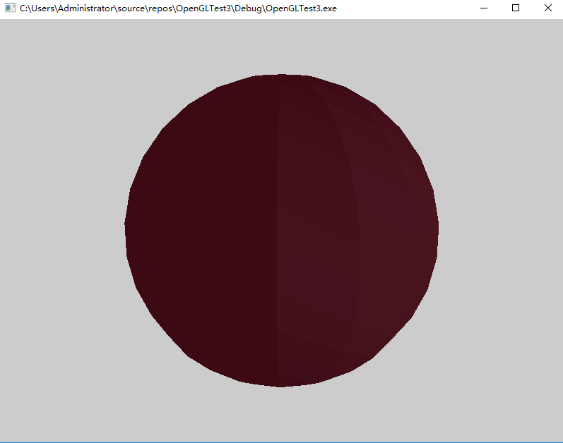
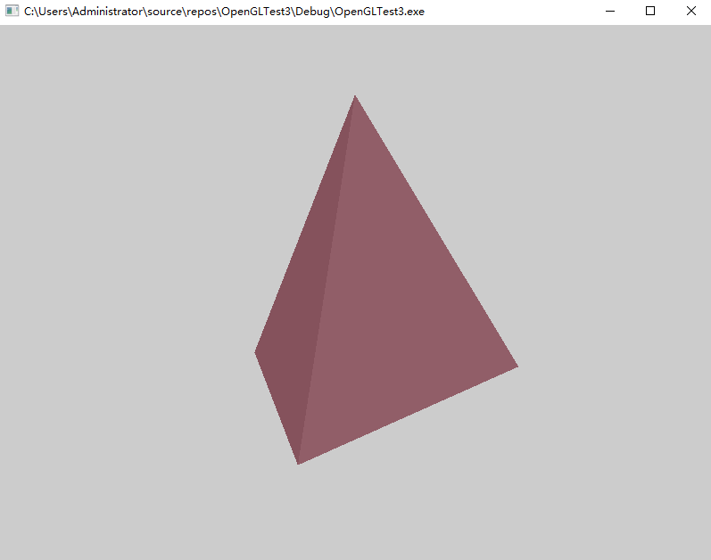
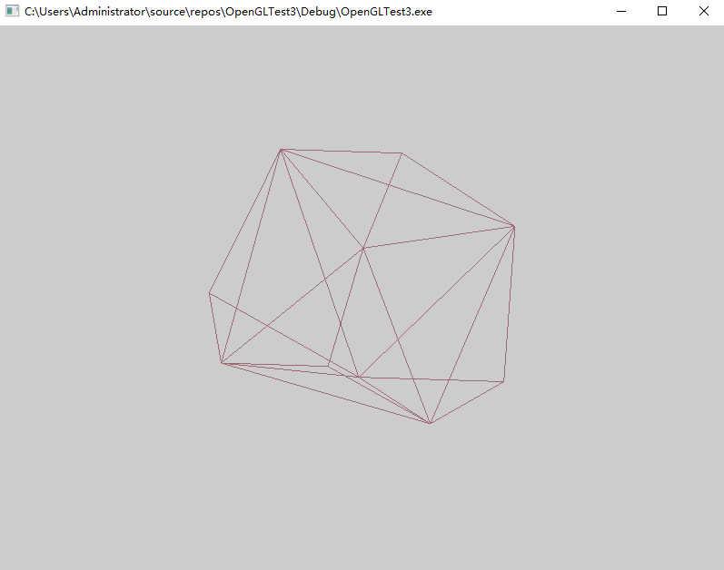
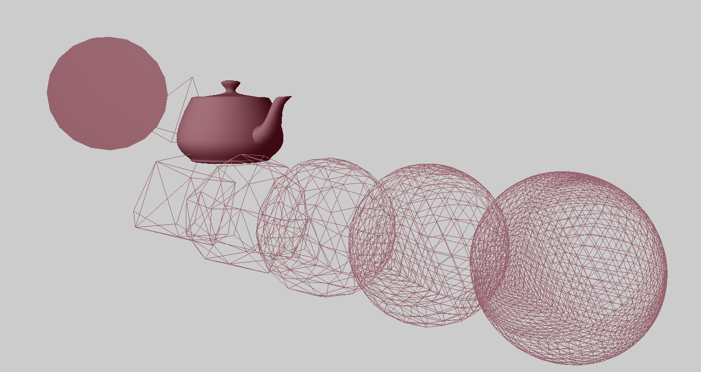

# 实验报告
    2019.04.09 第三次实验报告
    姚添译 19020182203646

## Task1
1. **单位球面，使用FLAT平面着色**
    
<br>

1. **正四面体**
    
<br>

1. **细分一次**
    
<br>

1. **细分$n$次**
    这个部分之前自己写代码写得太乱还有BUG，提交的时候用的是书上的代码。
    ```C
    GLfloat R0 = 1.0;
    GLfloat v[4][3] = { {0.0,0.0,1.0},{0.0,R0*0.942809,-R0 * 0.333333},
    {-R0 * 0.816497,-R0 * 0.471405,-R0 * 0.333333},
    {R0 * 0.816497,-R0 * 0.471405,-R0 * 0.333333} };

    void normalize(GLfloat *p) {
        double d = 0.0;
        int i;
        for (i = 0; i < 3; i++) d += p[i] * p[i];
        d = sqrt(d);
        if (d > 0.0) for (i = 0; i < 3; i++) p[i] = R0 * p[i] / d;
    }

    void drawTriangle(GLfloat *a, GLfloat *b, GLfloat *c) {
        glBegin(GL_LINE_LOOP);
        glVertex3fv(a);
        glVertex3fv(b);
        glVertex3fv(c);
        glEnd();
    }

    void divideTriangle(GLfloat *a, GLfloat *b, GLfloat *c, int n) {
        GLfloat v1[3], v2[3], v3[3];
        int j;
        if (n > 0) {
            for (j = 0; j < 3; j++) v1[j] = a[j] + b[j];
            normalize(v1);
            for (j = 0; j < 3; j++) v2[j] = a[j] + c[j];
            normalize(v2);
            for (j = 0; j < 3; j++) v3[j] = b[j] + c[j];
            normalize(v3);
            divideTriangle(a, v2, v1, n - 1);
            divideTriangle(b, v1, v3, n - 1);
            divideTriangle(c, v3, v2, n - 1);
            divideTriangle(v1, v2, v3, n - 1);
        }
        else drawTriangle(a, b, c);
    }

    void drawTetrahedron(int n) {
        divideTriangle(v[0], v[1], v[2], n);
        divideTriangle(v[3], v[2], v[1], n);
        divideTriangle(v[0], v[3], v[1], n);
        divideTriangle(v[0], v[2], v[3], n);
    }
    ```
    <br>
    可以看到这种细分方式虽然可以快速逼近一个球，但是各个面大小的差距较大，不美观也不方便操作。
    <br><br>

    

## Task2
1. **绘制茶壶**
1. **键盘控制视角变化**
    这两个内容只贴一张图，以上所有动画都是键盘操作得到的。
    
<br>

##全家福

<br>
