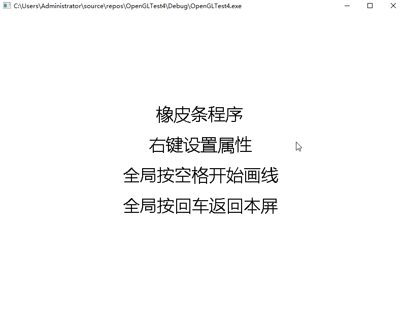
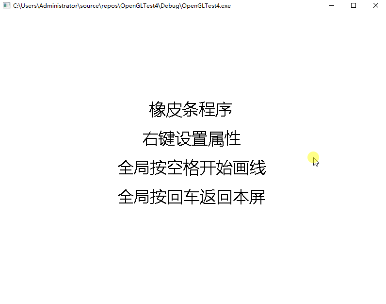
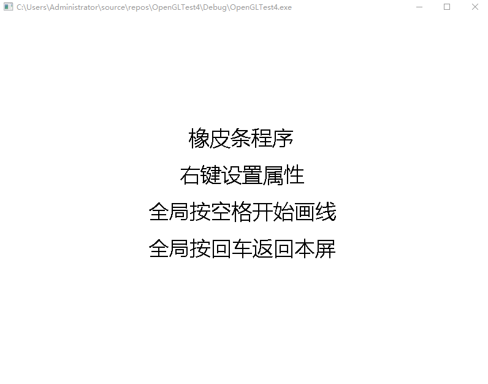

# 实验报告
    2019.04.22 第四次实验报告
    姚添译 19020182203646

## Task1
### 任务目标：
1.  添加菜单，使得可以改变线的颜色、线型、线宽等属性。**（已完成）**
1.  允许画多条直线，前面画过的直线不会消失。**（已完成）**

#### 1. 添加了绘制文字功能
```C
//在窗口上显示字符
void glPrint(const char* str)
{
    int len, i;
    wchar_t* wstring;
    HDC hDC = wglGetCurrentDC();
    GLuint list = glGenLists(1);

    // 计算字符的个数
    len = 0;
    for (i = 0; str[i] != '\0'; ++i){
        if (IsDBCSLeadByte(str[i])) ++i;
        ++len;
    }

    // 将混合字符转化为宽字符
    wstring = (wchar_t*)malloc((len + 1) * sizeof(wchar_t));
    if (wstring != NULL) {
        MultiByteToWideChar(CP_ACP, MB_PRECOMPOSED, str, -1, wstring, len);
        wstring[len] = L'\0';

        for (i = 0; i < len; ++i){
            wglUseFontBitmapsW(hDC, wstring[i], 1, list);
            glCallList(list);
        }

        //垃圾回收
        free(wstring);
        glDeleteLists(list, 1);
    }
}
```
```C
//设置显示字符的属性
void glSetFont(int size, int charset, const char* face) {
    HFONT hFont = CreateFontA(size, 0, 0, 0, FW_MEDIUM, 0, 0, 0,
        charset, OUT_DEFAULT_PRECIS, CLIP_DEFAULT_PRECIS,
        DEFAULT_QUALITY, DEFAULT_PITCH | FF_SWISS, face);
    HFONT hOldFont = (HFONT)SelectObject(wglGetCurrentDC(), hFont);
    DeleteObject(hOldFont);
}
```
以上调用Windows API和glut库写了两个函数：
```C 
//绘制字符串str
void glPrint(const char* str);
//参数列表：字号，指定字符集（主要使用ANSI_CHARSET），字体
void glSetFont(int size, int charset, const char* face);
```
分别用来画出文字和设置字符显示的属性。<br></br>
添加这个功能主要是为了直观地进行操作提示，效果如图：

对应代码（放在display回调中）：
```C
glRasterPos2d(-0.3, 0.3);                           //设置位置偏移量
glSetFont(45, ANSI_CHARSET, "Microsoft YaHei");     //更新字体状态
glPrint("橡皮条程序");
glRasterPos2d(-0.35, 0.1);                          //玄学调参
glPrint("右键设置属性");
glRasterPos2d(-0.52, -0.1);
glPrint("全局按空格开始画线");
glRasterPos2d(-0.52, -0.3);
glPrint("全局按回车返回本屏");
```
<br></br>

#### 2.  添加了三个菜单：颜色，线宽，线形

菜单功能：
**Color**：通过点选屏幕上的**颜色三角形**来选定线的**颜色**，并有一个小方块可以**实时预览颜色**。
**Size**：通过上下方向键调整线的**宽度**。
**Type**：通过上下方向键调整线的**形状**（实线、点划线、虚线等），左右方向键调整线的密集程度。
<br></br>
##### Color部分的关键代码：
```C
void changeColor() {
    //画出颜色三角形
    GLdouble cR = 1.0;
    glBegin(GL_POLYGON);
    glColor3d(1.0, 0.0, 0.0);
    glVertex3d(-0.8660254038 * cR, -0.75 * cR, 0.0);
    glColor3d(0.0, 1.0, 0.0);
    glVertex3d(0.8660254038 * cR, -0.75 * cR, 0.0);
    glColor3d(0.0, 0.0, 1.0);
    glVertex3d(0, 0.75 * cR, 0.0);
    glEnd();

    //读取鼠标所指处的颜色作为预览颜色
    glReadPixels(x_now, win_height - y_now, 1, 1,
        GL_RGB, GL_UNSIGNED_BYTE, colorBufferp);

    //画出颜色预览矩形
    glBegin(GL_POLYGON);
    glColor3ubv(colorBufferp);
    glVertex3d(0.7, 0.7, 0.0);
    glVertex3d(0.6, 0.7, 0.0);
    glVertex3d(0.6, 0.6, 0.0);
    glVertex3d(0.7, 0.6, 0.0);
    glEnd();

    glFlush();

    //读取点击的点的颜色作为实际画线的颜色
    glReadPixels(x_color, win_height - y_color, 1, 1,
        GL_RGB, GL_UNSIGNED_BYTE, penColorp);
}
```
其中x_now, y_now是从mouseFunc返回的实时鼠标坐标，指针`colorBufferp`指向当前鼠标所指部分的颜色，`penColorp`指向线的颜色。

效果演示（GIF颜色有所差别，实际颜色平滑过渡）：


##### Size部分的关键代码：
```C
void changeSize() {    
    //载入penWitdh的初值
    glLineWidth(penWidth);

    //检测颜色是否被选择过，缺省为红色
    x_color ? glColor3ubv(penColorp) :
        glColor3d(1.0, 0.0, 0.0);

    //画一条线以作预览
    glBegin(GL_LINES);
    glVertex3d(-0.8, 0.0, 0.0);
    glVertex3d(0.8, 0.0, 0.0);
    glEnd();
    glFlush();
}
```
在specialFunc中设置了方向键的作用：
```C
switch (key) {
    case GLUT_KEY_UP:
        if (penWidth < 10)penWidth += 1;
        break;
    case GLUT_KEY_DOWN:
        if (penWidth > 1) penWidth -= 1;
        break;
}
```

效果演示：



##### Type部分的关键代码：
```C
//全局变量
GLint lineType[8] = {
    1,                      //线形编号
    4,                      //线形重复次数
    0b1111111111111111 ,    //几种默认的线形
    0b0010011111111111 ,
    0b1010101010101010 ,
    0b0111100001111000 ,
    0b0100010001000100 ,
    0b0010011100100111
};
```
```C
void changeType() {
    //设置线形
    glLineStipple(1.0 * lineType[1], lineType[lineType[0] % LINETYPE + 1]);
    x_color ? glColor3ubv(penColorp) : glColor3d(1.0, 0.0, 0.0);

    //画一条预览线
    glBegin(GL_LINES);
    glVertex3d(-0.8, 0.0, 0.0);
    glVertex3d(0.8, 0.0, 0.0);
    glEnd();
    glFlush();
}
```
同样地，在specialFunc中也设置了相关的功能：
```C
switch (key) {
    case GLUT_KEY_UP:
        lineType[0]++;
        break;
    case GLUT_KEY_DOWN:     //防止越界
        lineType[0] ? lineType[0]-- : lineType[0] = LINETYPE + 2;
        break;
    case GLUT_KEY_LEFT:
        if (lineType[1]) lineType[1]--;
        break;
    case GLUT_KEY_RIGHT:
        if (lineType[1] < 128) lineType[1]++;
        break;
}
```
在初始化时必须设置`glEnable(GL_LINE_STIPPLE)`才能改变线形。

效果演示：


#### 3.橡皮条的实现
```C
//一些全局变量
GLdouble linePos[100][4];   //数组存储(x1,y1,x2,y2)四元组，最多存100条线
GLint clickCnt = 0;         //鼠标点击的次数
```
```C
//把屏幕像素坐标映射到openGL的内部坐标，并把结果储存在全局变量x_adpt,y_adpt中
//因为没有考虑要复用这个函数，所以把存储的变量名直接写进去了，更合理的方式应该以指针为参数。
void CoorAdapt(GLint x, GLint y) {
    x_adpt = (2.0 * x / win_width - 1.0) * (1.0 * win_width / win_height);
    y_adpt = 2.0 * (win_height - 1.0 * y) / win_height - 1.0;
}
```
```C
//在鼠标回调函数内部
//当画橡皮条时，存储线的始末位置到相应的linePos数组位置
CoorAdapt(x, y);

if (!clickCnt) {
    linePos[0][0] = x_adpt;
    linePos[0][1] = y_adpt;
}
else if (clickCnt % 2) {
    linePos[(clickCnt - 1) / 2][2] = x_adpt;
    linePos[(clickCnt - 1) / 2][3] = y_adpt;
}
else {
    linePos[clickCnt / 2][0] = x_adpt;
    linePos[clickCnt / 2][1] = y_adpt;
}
clickCnt++;
```
```C
void drawScence() {
    x_color ? glColor3ubv(penColorp) : glColor3d(1.0, 0.0, 0.0);
    CoorAdapt(x_now, y_now);        //坐标转换

    if (clickCnt) {
        if (clickCnt % 2) {
            //点击了奇数次时，有若干条线已经画完，新线起点已定，终点时刻跟随鼠标
            glBegin(GL_LINES);
            for (int i = 0; i < (clickCnt - 1) / 2; i++) {
                glVertex3d(linePos[i][0], linePos[i][1], 0.0);
                glVertex3d(linePos[i][2], linePos[i][3], 0.0);
            }
            glVertex3d(linePos[(clickCnt - 1) / 2][0],
                linePos[(clickCnt - 1) / 2][1], 0.0);       //新线的起点
            glVertex3d(x_adpt, y_adpt, 0.0);                //终点跟随鼠标
            glEnd();
            glFlush();
        }
        else {
            //偶数次计数，只需要画出存储的若干对
            glBegin(GL_LINES);
            for (int i = 0; i < clickCnt / 2; i++) {
                glVertex3d(linePos[i][0], linePos[i][1], 0.0);
                glVertex3d(linePos[i][2], linePos[i][3], 0.0);
            }
            glEnd();
            glFlush();
        }
    }
}
```
这个地方写了很久，原因是初始化时画线遵循的规律（第一个点没有给出）与后来的规律（前一个点已经给出）不同，同时点击的奇偶次数不同也会有不同的处理方式，多次修复BUG之后终于成功实现了这个功能。

另外，考虑到要与前述设置属性的功能相协调，并出于优化流程的目的，我引入了**显示模式**的控制变量。
```C
enum displayMode { C_BEGIN, C_COLOR, C_SIZE, C_TYPE, C_DRAW };    //显示模式的id序列
GLint DISPLAY_MODE = C_BEGIN;                                     //初始化
```
```C
//显示回调函数
void display(void) {
    glClear(GL_COLOR_BUFFER_BIT);

    switch (DISPLAY_MODE) {
    case C_COLOR:
        changeColor();
        break;
    case C_SIZE:
        changeSize();
        break;
    case C_TYPE:
        changeType();
        break;
    case C_DRAW:
        drawScence();
        break;
    default:
        defaultDisplay();
        break;
    }

    glutPostRedisplay();
    glutSwapBuffers();
}
```。
```C
//键盘回调
void keybroad(unsigned char key, int x, int y) {
    switch (key) {
    case 27:                                        //ESC
        exit(0);
        break;
    case 13:                                        //回车返回主屏
        DISPLAY_MODE = C_BEGIN;
        break;
    case 32:                                        //空格开始画线
        DISPLAY_MODE = C_DRAW;
        break;
    case 'c':
        if (DISPLAY_MODE == C_DRAW)
            clickCnt = 0;                            //画线时按c清屏(但是没有删除数据，只会重新写入)
    }
}
```

自此程序主体完成，经过一番调试之后，整体使用效果如下（线没消掉的BUG是GIF解码的问题）：


## Task2
### 任务目标：
1.  添加菜单，允许选择画点、画线、或者画多边形着色。（未完成）
1.  设置鼠标左键、中键、右键回调函数，使其分别实现对模型进行旋转、平移和缩放。（部分完成）
1.  试着看看能不能设置光照（自学教材、红宝书相关章节）。**（已完成）**

由于时间关系，Task2的完成度没有Task1那么高 ~~，不过前两条我真的会做~~，所以只是实现了写入ply文件并画出合适的效果，添加了轨迹球（轨迹球基本是各处扒下来的）。

先贴出读取文件信息相关的代码：
```C
int readInfo(int* info, const char* file_adress) {
    constexpr auto MAX_CHAR = 255;        //每行最多字符数
    char buf[MAX_CHAR];                   //每行读取出的缓存
    FILE* fp;
    int lines = 0;                        //到end_header一共几行

    if (fopen_s(&fp, file_adress, "r+"))
        return -1;                        //打开失败

    if (fp != NULL) {
        while (fgets(buf, MAX_CHAR, fp) != NULL) {
            lines++;
            if (!strcmp(buf, "end_header\n")) {
                //获取头部结束位置
                info[2] = lines;
                break;
            }
            if (!strncmp(buf, "element vertex ", 15)) {
                //获取element vertex 后面的数字
                char* tmp = buf;
                while (strchr(tmp, ' ') != NULL)
                {
                    tmp = strchr(tmp, ' ') + 1;
                }
                info[0] = atoi(tmp);
            }
            else if (!strncmp(buf, "element face ", 13)) {
                //获取element face 后面的数字
                char* tmp = buf;
                while (strchr(tmp, ' ') != NULL)
                {
                    tmp = strchr(tmp, ' ') + 1;
                }
                info[1] = atoi(tmp);
            }
        }
        fclose(fp);
    }

    return 0;
}
```
```C
int readData(VertexData* vd, FaceData* fd, int* info, const char* file_adress) {
    constexpr auto MAXLINE = 255;
    FILE* fp;
    char buf[MAXLINE];

    int line = 0;                        //行数计数器
    int vertex = info[0];                //一共多少顶点
    int face = info[1];                  //一共多少面
    int header = info[2];                //头部长度

    if (fopen_s(&fp, file_adress, "r+"))
        return -1;

    if (fp != NULL) {                    //读取数据
        while (fgets(buf, MAXLINE, fp) != NULL) {
            line++;
            if (line > header && line <= header + vertex) {
                //读取顶点坐标和法向
                int t = 0;
                char* token = NULL;
                char* next_token = NULL;
                token = strtok_s(buf, " ", &next_token);
                while (t < 6 && token != NULL) {
                    if (t < 3 && token != NULL) {
                        vd[line - header - 1].pos[t] = (float)atof(token);
                        token = strtok_s(NULL, " ", &next_token);
                    }
                    else if (t >= 3 && token != NULL) {
                        vd[line - header - 1].nor[t - 3] = (float)atof(token);
                        token = strtok_s(NULL, " ", &next_token);
                    }
                    t++;
                }
            }
            else if (line > header + vertex) {
                //读取面对应的点
                int t = 0;
                char* token = NULL;
                char* next_token = NULL;
                token = strtok_s(buf, " ", &next_token);
                while (t < 4 && token != NULL) {
                    if (token != NULL) {
                        fd[line - vertex - header - 1].index[t] = atoi(token);
                        token = strtok_s(NULL, " ", &next_token);
                    }
                    t++;
                }
            }
        }
        fclose(fp);
    }
    return 0;
}
```

之前没接触过文件读写的处理。我先扫了一眼我们C语言的教材，然后在VS上敲了敲书上的代码，结果全是error和warning，一看错误提示才知道VS已经不支持很多像`fopen` `strtok`这种的不太安全的函数而改用`fopen_s` `strtok_s`了。这些函数的参数列表也有变化，所以我研究了好久之后才终于写出了这两个函数。

有了读取的函数，接下来就是怎么读了：
```C
//全局
typedef struct {
    float pos[3];                        //点的位置
    float nor[3];
}VertexData;

typedef struct {
    int index[4];                        //面的顶点信息
}FaceData;

GLint ModelInfo[3] = { 0,0,0 };          //模型的顶点数，面片数，ply文件中end_header对应的行数
VertexData* vData;                       //顶点数据
FaceData*   fData;                       //面数据
```
采用了一个数组存储模型的总体信息，两个数组用于存放顶点，法向和面对应的点序号：
```C
//init函数中的相关部分
int init(){
    const char* model_adress = "lizhenxiout-repaired.ply";

    if (readInfo(ModelInfo, model_adress) == -1) {
        perror("Cann't read Information");
        return -1;
    }

    //分配内存
    vData = (VertexData*)malloc(6 * ModelInfo[0] * sizeof(float));
    fData = (FaceData*)malloc(4 * ModelInfo[1] * sizeof(int));

    if (readData(vData, fData, ModelInfo, model_adress) == -1) {
        perror("Cann't read data");
        return -2;
    }
}
```
```C
//main内部的处理
if (init() != 0) {
    char pause = getchar();
    return -1;
}
else printf("Model data:\nvertices = %d\nfaces = %d\n"
    "Read successfully.\n", ModelInfo[0], ModelInfo[1]);
```
这样数据就可以读取进两个数组，接下来只要对应地画出来就行了，比较简单：
```C
void drawModel() {
    if (sizeof(*vData) > 1) {
        glBegin(GL_TRIANGLES);
        for (int i = 0; i < ModelInfo[1]; i++) {
            for (int j = 1; j <= 3; j++) {
                glNormal3d(
                    vData[fData[i].index[j]].nor[0],
                    vData[fData[i].index[j]].nor[1],
                    vData[fData[i].index[j]].nor[2]);
                glVertex3d(
                    vData[fData[i].index[j]].pos[0] / 500,
                    vData[fData[i].index[j]].pos[1] / 500,
                    vData[fData[i].index[j]].pos[2] / 500);
                    //除以500相当于标准化到[-2,2]区间里
            }
        }
        glEnd();
    }
}
```
最后添加一点简单的光源：
```C
void lightDisplay(void) {
    //材质反光性设置
    GLfloat mat_specular[] = { 1.0, 1.0, 1.0, 1.0 };            //镜面反射参数
    GLfloat mat_shininess[] = { 120.0 };                        //高光指数
    GLfloat light_position[] = { -1.0, 1.0, 1.0, 1.0 };         //最后1是开关
    GLfloat white_light[] = { 1.0, 1.0, 1.0, 1.0 };
    GLfloat Light_Model_Ambient[] = { 1.0, 1.0, 1.0, 1.0 };     //环境光参数

    glClearColor(0.0, 0.0, 0.0, 0.0);
    glShadeModel(GL_SMOOTH);

    //材质属性
    glMaterialfv(GL_FRONT, GL_SPECULAR, mat_specular);
    glMaterialfv(GL_FRONT, GL_SHININESS, mat_shininess);

    //灯光设置
    glLightfv(GL_LIGHT0, GL_POSITION, light_position);
    glLightfv(GL_LIGHT0, GL_DIFFUSE, white_light);               //散射光属性
    glLightfv(GL_LIGHT0, GL_SPECULAR, white_light);              //镜面反射光
    glLightModelfv(GL_LIGHT_MODEL_AMBIENT, Light_Model_Ambient); //环境光参数

    glEnable(GL_LIGHTING);
    glEnable(GL_LIGHT0);
}
```
再加了个`glutFullScreen()`全屏。

效果如下：


然后从网上扒了个轨迹球的功能，又调了调模型的位置和大小 ~~（所以我会用平移旋转缩放）~~，之后变成了这样：


由于时间原因就先完成到这里了。

