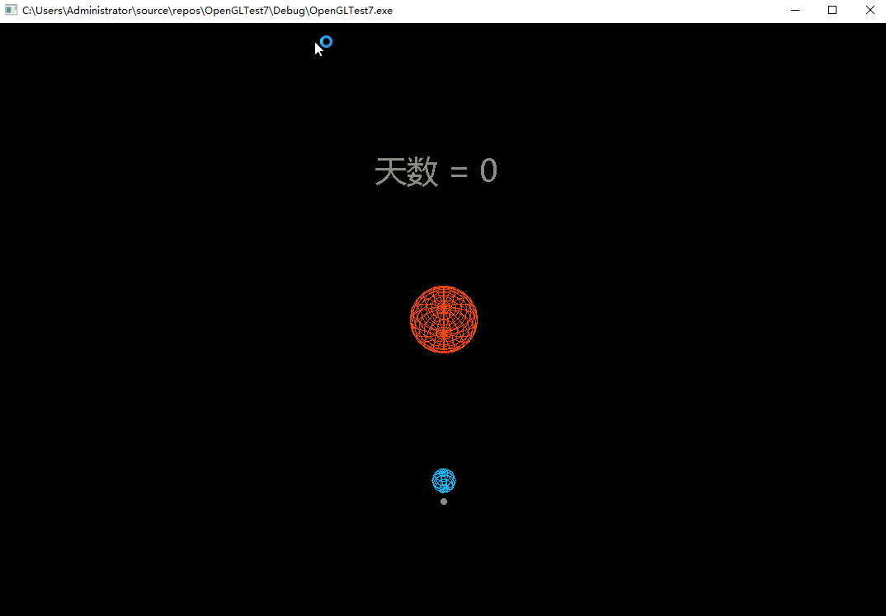

# 实验报告
    2019.05.05 第五次实验报告
    姚添译 19020182203646

## Task1
### 任务目标：导入一个ply模型，并绘制。
1.    计算此模型的重心（所有顶点位置的平均值）**（已完成）**
1.    利用OpenGL函数，以此模型重心为旋转中心，旋转此模型。**（已完成）**

#### 计算重心
直接求和再平均。
```C
void getBarycenter(VertexData * vData, GLint Vertice, GLdouble * barycenter) {
    for (int i = 0; i < Vertice; i++) {
        barycenter[0] += vData[i].pos[0];
        barycenter[1] += vData[i].pos[1];
        barycenter[2] += vData[i].pos[2];
    }
    barycenter[0] /= Vertice;
    barycenter[1] /= Vertice;
    barycenter[2] /= Vertice;
}
```

#### 旋转模型
这个和轨迹球一起的，不单独分出来了，作业交的是轨迹球。
```C
void idleFunc() {
    if (isDragging) {
        glTranslated(modelBC[0] / 1000, modelBC[1] / 1000, modelBC[2] / 1000);
        glRotatef(rotateAngle, rotateNormal[0], rotateNormal[1], rotateNormal[2]);
        glTranslated(-modelBC[0] / 1000, -modelBC[1] / 1000, -modelBC[2] / 1000); drawModel();
    }
}
```
这部分是用来在`glutIdleFunc`回调函数里面调整模型角度的，效果如下：


## Task2
### 任务目标：绘制太阳、地球、月球三者运动动画。
1.  用不同大小的球代表太阳、地球、月球；**（已完成）**
1.  地球和月球共同绕太阳旋转，月球同时还绕地球旋转。**（已完成）**

#### 各个星球的矩阵设置
```C
//太阳 自转=25.05天 并假设太阳不公转
glPushMatrix();

glRotated(angle / 25.05, 0.0, 1.0, 0.0);

glutWireSphere(1.0, 20, 16);

glPopMatrix();
```
```C
//地球 公转=365.24天 自转=1天
glPushMatrix();

glRotated(angle / 365.24, 0.0, 1.0, 0.0);
glTranslated(0.0, 0.0, 7.0);
glRotated(angle, 0.0, 1.0, 0.0);

glutWireSphere(0.2, 10, 8);

//月球  自转=公转=27.32天
glRotated(-angle - angle / 365.24 + angle / 27.32, 0.0, 1.0, 0.0);
glTranslated(0.0, 0.0, 0.5);

glutWireSphere(0.05, 10, 8);

glPopMatrix();
```
其中`angle`是地球自转的转角，也是其他星球转动的基准。

#### 显示运行了多少天
```C
char str[32] = "天数 = ";
char str2[16];
_itoa_s((int)(angle / 360.0), str2, 16, 10);
strcat_s(str, sizeof(str), str2);
```
然后在屏幕上合适的位置绘制`str`的文字。

总体效果：

