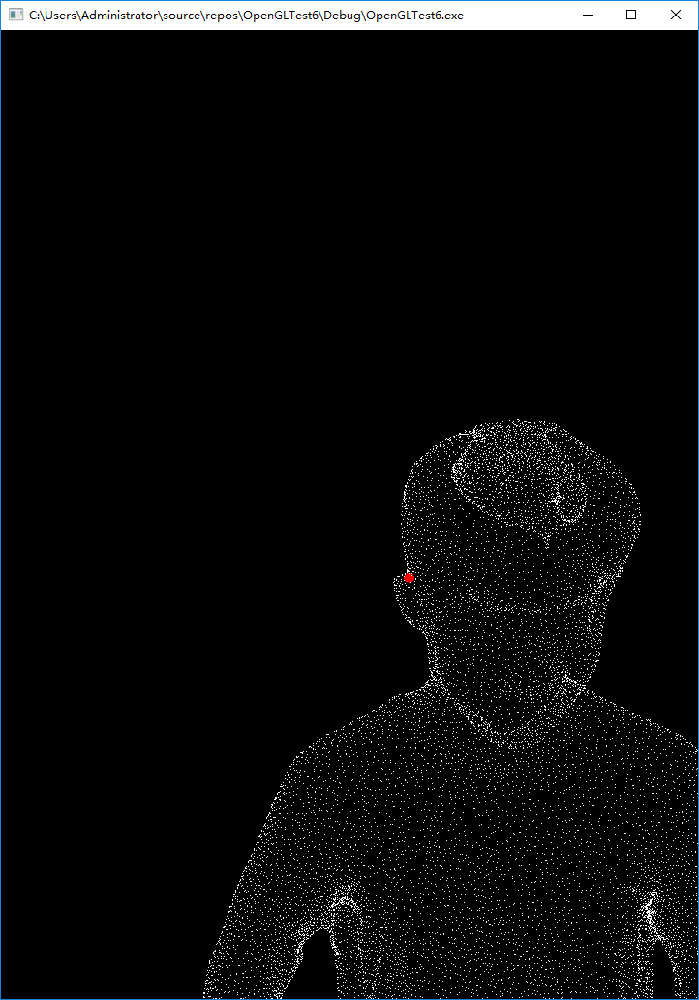
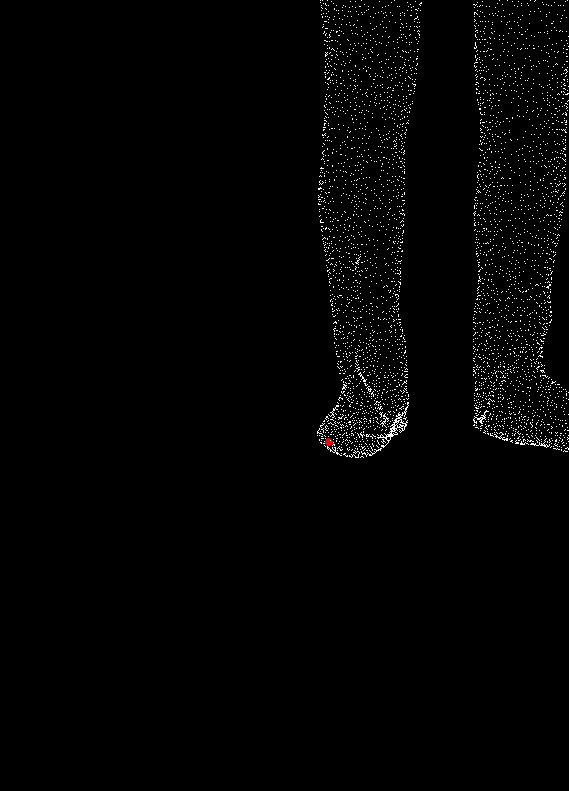
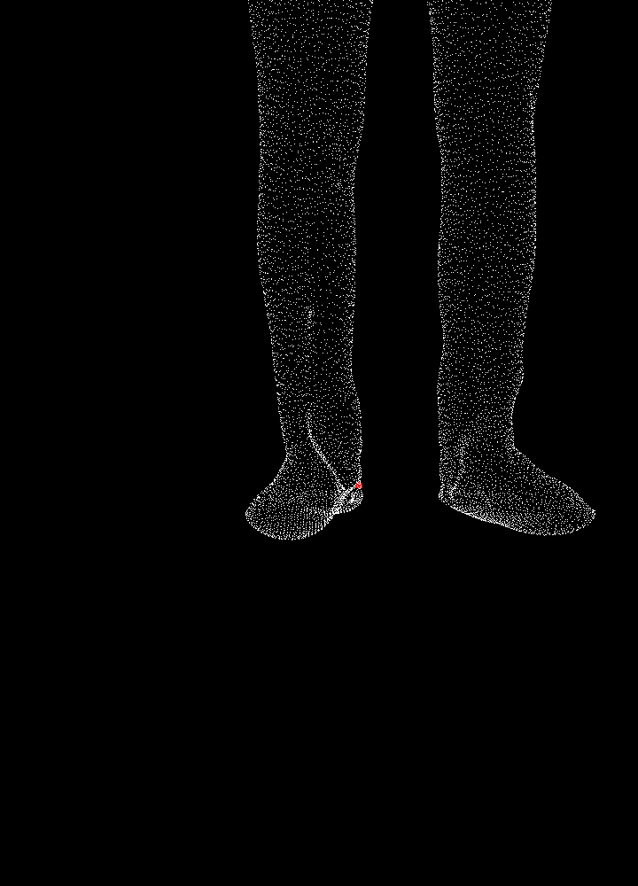
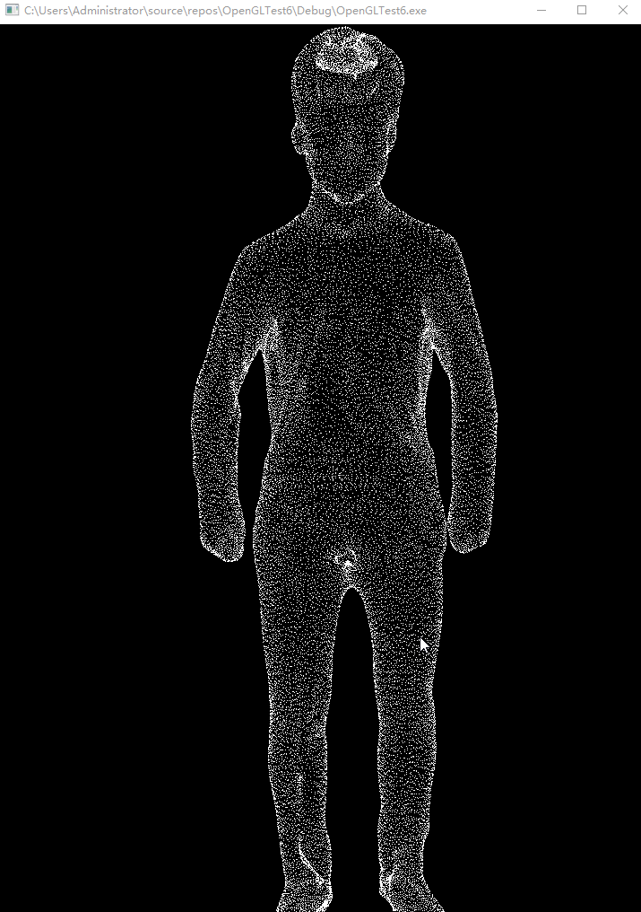

<script type="text/javascript" async src="https://cdn.mathjax.org/mathjax/latest/MathJax.js?config=TeX-MML-AM_CHTML"> </script>

# OpenGL第六次实验
---
>2019.4.22

作业：点云拾取和轨迹球的实现
<!-- more -->
---
## Task1
### 任务目标：实现点云拾取
1.  导入一个.ply模型，并绘制。**（已完成）**
1.  能利用鼠标左键选取模型上的一个点，对选中的点用其他颜色高亮显示。**（已完成）**

#### 平面选点并确定其在三维空间中的位置
三维到二维的映射通常是不可逆的（因为对应的变换矩阵未必满秩）。但是由于OpenGL可以开启深度缓冲区，实际上由模型视图矩阵，投影矩阵，视口信息和深度值可以确定一个世界坐标与屏幕坐标的双射。
不过这个题目并不要求将二维点映射回三维坐标，因此会更简单。

实现过程：
```C
//在mouseFunc中...
GLdouble modelview_matrix[16];
GLdouble projection_matrix[16];
GLint viewport[4];

glGetIntegerv(GL_VIEWPORT, viewport);
glGetDoublev(GL_MODELVIEW_MATRIX, modelview_matrix);
glGetDoublev(GL_PROJECTION_MATRIX, projection_matrix);

GLdouble min_distance = 20.0;   //如果距离平方大于这个数，认为没有点到任何点
GLdouble win_x = 0, win_y = 0, win_z = 0;
GLdouble new_y = viewport[3] - 1.0 * y;

for (int i = 0; i < ModelInfo[0]; i++) {
    gluProject(vData[i].pos[0] - modelBC[0], vData[i].pos[1] - modelBC[1], vData[i].pos[2] - modelBC[2],
               modelview_matrix, projection_matrix, viewport, &win_x, &win_y, &win_z);
    //modelBC存储着模型的重心坐标
    GLdouble distance = (win_x - x) * (win_x - x) + (win_y - new_y) * (win_y - new_y);
    //这里为了效率没有开根号

    if (min_distance > distance) {
        min_distance = distance;
        min_index = i;
    }
}
```

#### 选到点之后高亮显示

最开始的思路是，在每次刷新图像的时候把选中的点放大并换个颜色绘制。但是这样的效果我没有实现：出于不明原因，`glPointSize()`这个属性在我这里完全不管用，因此只实现了换颜色，不能实现点放大。所以最终的效果几乎看不清选中的点在哪里。
后来重写了这部分，解决措施是在选中的点的位置原地画一个红色实心球，并把视角拉近，最终的效果由于视角拉近没有动画效果显得有些突兀，但是整体上实现了选点高亮，也有了便于观察的特点。




整体演示：


## Task2
### 任务目标：实现虚拟轨迹球
1.  导入一个.ply模型，并绘制。**（已完成）**
1.    能利用鼠标左键拖动轨迹球，观察物体不同角度。**（已完成）**
1.    要处理鼠标落点在轨迹球之外的情况。**（已完成）**

#### 轨迹球设计
轨迹球和点云选点一样，本质也是寻求一个二维与三维之间的映射关系，使得用户可以通过二维的行为操作三维图形。

轨迹球功能应该是一个无限平面 $\rightarrow$ 有限球面的映射，使得用户在拖动鼠标时能获得与移动图形的外接球等同的旋转感，直观上可以建立映射 $f:R^2\rightarrow R^3$ ：
$$ \begin{cases}
x'=x\\
y'=y\\
z'=\sqrt{r^2-(x^2+y^2)}
\end{cases} $$
但是考虑到 $r^2-(x^2+y^2)<0$ 时 $z'\notin\bf{R} $ ，一种方法是算圆外点与边界的交点，另一种方法是在外界填充平滑曲面。我采用第二种方法，因为这样可以使旋转更加平滑。
我采用的填充曲面是：
$$z'=\frac{\frac{1}{2}-x^2-y^2}{2(1+(\frac{1}{2}-x^2-y^2))}$$
它在 $x^2+y^2>\frac{1}{4}$ 时的图像与球拼接得比较好，这也方便直接计算运动首尾两个向量的外积，从而便于计算移动夹角。


下面是代码实现：
```C
//先抽象出一个映射类型
typedef struct
{
    GLint plane[2];
    GLfloat ball[3];
}Injection;
```
```C
//完成映射过程
void ballInjection(Injection * inj) {
    GLint   x = inj->plane[0];
    GLint   y = win_height - inj->plane[1];
    inj->ball[0] = 2.0 * (1.0 * x / win_width - 0.5);
    inj->ball[1] = 2.0 * (1.0 * y / win_height - 0.5);
    GLfloat X = inj->ball[0];
    GLfloat Y = inj->ball[1];
    GLfloat zz = 1.0 - 1.0 * X * X - 1.0 * Y * Y;
    if (zz >= 0.25) inj->ball[2] = sqrt(zz);
    else inj->ball[2] = 0.5 * 1 / (1 + 1.0 * (0.5 - 1.0 * X * X - 1.0 * Y * Y) 
        * (0.5 - 1.0 * X * X - 1.0 * Y * Y));
}
```
```C
//任意给定两组映射，返回夹角和外积
void getRotateAngle(Injection sInj, Injection cInj, GLdouble * angle, GLfloat * normal) {
    GLfloat x0 = sInj.ball[0];
    GLfloat y0 = sInj.ball[1];
    GLfloat z0 = sInj.ball[2];
    GLfloat x = cInj.ball[0];
    GLfloat y = cInj.ball[1];
    GLfloat z = cInj.ball[2];
    normal[0] = y0 * z - y * z0;
    normal[1] = x * z0 - x0 * z;
    normal[2] = x0 * y - y0 * x;
    GLfloat r1 = sqrt(1.0 * x0 * x0 + 1.0 * y0 * y0 + 1.0 * z0 * z0);
    GLfloat r2 = sqrt(1.0 * x * x + 1.0 * y * y + 1.0 * z * z);
    *angle = acos((1.0 * x0 * x + 1.0 * y0 * y + 1.0 * z0 * z) / r1 / r2) * 57.3 * 1.5;
}
```
最后在`mouseMotionFunc`里对鼠标按下时的位置映射和当前鼠标的位置映射计算夹角，并刷新模型视图矩阵即可。

效果演示：

